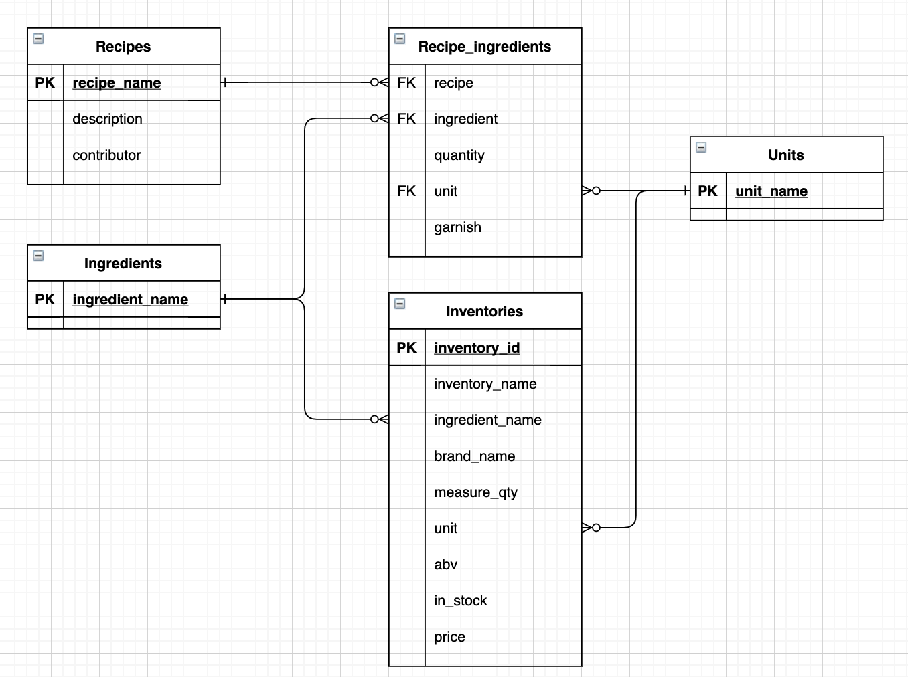

# cocktail-recipe
#### API Paths

> /recipes (GET, POST)
>
> /recipes/<recipe_name> (GET)
>
> /inventories (GET)
>
> /inventories/<inventory_id> (GET)

#### Database
> database design for recipes and inventories

>
> Find sql script for creating the tables in ./SQLSripts

#### Request message examples for POST
> /recipes (POST)
>
    {
        "recipe_name": "Cosmopolitan",
        "description": "A legendary drink",
        "contributor": "Terry",
        "ingredients": [
            {
                "ingredient_name": "citron vodka",
                "quantity": "1 1/2",
                "unit": "oz",
                "garnish": 0
            },
            {
                "ingredient_name": "cranberry juice",
                "quantity": "1",
                "unit": "oz",
                "garnish": 0
            },
            {
                "ingredient_name": "cointreau",
                "quantity": "1/2",
                "unit": "oz",
                "garnish": 0
            },
            {
                "ingredient_name": "lime juice",
                "quantity": "1/2",
                "unit": "oz",
                "garnish": 0
            },
            {
                "ingredient_name": "lime wedge",
                "garnish": 1
            }
        ]
    }
